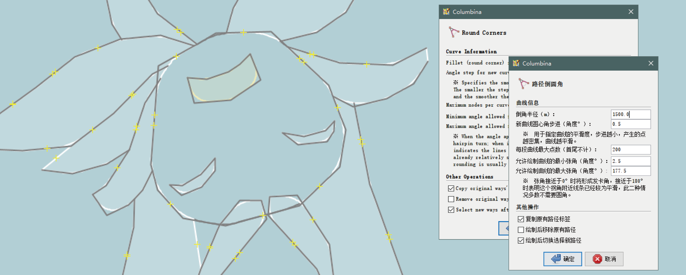

# Corner-Optimal Line Utility Modifier for Better Inflection and Node Adjustment (*Columbina*)   用于改进弯折与节点调整的转角优化线型之实用修改器

A Java OpenStreetMap (JOSM) pulgin providing convenient Fillet (round corner) and Chamfer drawing, and …   might provide Transition Curve features in the future.
  一个提供倒圆角和倒斜角工具的Java OpenStreetMap（JOSM）插件，未来计划开发缓和曲线功能。

  

  <small><s>The name of this plugin has absolutely no relationship with Kuutar or Columbina Hyposelenia, and it's definitely not an attempt to fit the meme. xd
  本插件的名称绝对与库塔尔或哥伦比娅·希珀塞莱尼娅无关，绝对不是凑的名字。（逃</s></small>

## Quick Start · 快速开始

To get quick start, please download the [release](https://github.com/Daredemodaisuki/Columbina/releases) and copy it to your JOSM plugin directory `%APPDATA%\JOSM\plugins\` (for Windows, usually looks like `…\AppData\Roaming\JOSM\plugins\`).
  如欲快速开始，劳烦您下载一个[发布版本](https://github.com/Daredemodaisuki/Columbina/releases)，并复制到JOSM的插件文件夹`%APPDATA%\JOSM\plugins\`（视窗系统，通常是`…\AppData\Roaming\JOSM\plugins\`）下。

Then in JOSM's plugin preference, search and select *Columbina* and restart to activate *her*. Now you could use this plugin.
  随后在JOSM首选项之插件设置中，搜寻*Columbina*并勾选启用，重启JOSM后即可使用插件。

This plugin depends on another plugin, Utilsplugin2, which is typically included with JOSM by default. If your JOSM does not have Utilsplugin2 installed, JOSM will prompt you to install it.
  本插件依赖另一插件Utilsplugin2，其通常由JOSM自带，如果您的JOSM没有安装Utilsplugin2，JOSM会要求你一并安装。

## Features · 功能

All features are located under the More Tools (M) menu.
  所有功能均在更多工具〔M〕菜单下。

### Round Corner · 圆角 〔Alt+Ctrl+Shift+C〕

Allows users to fillet each corner node of the selected ways with a specified radius.
  允许用户对选定路径的每个拐角节点按指定半径倒圆角。

The plugin supports specifying the arc radius for fillets. Node density can be controlled via central angle increments, and a maximum number of nodes per curve segment is also provided for control.
Additionally, the plugin offers options to copy tags from the original way, remove the original way after drawing, and toggle selection to the new way after drawing.
  插件支持指定圆角的圆弧半径，可以通过圆心角步进控制节点密度并提供每段曲线最大点数控制。插件亦提供复制原有路径标签、绘制后移除原有路径、绘制后切换选择新路径的选项。

The plugin automatically and uniformly interpolates nodes along the curve, adding them at even intervals.
For longer curves (when the radius remains constant, curves with smaller deflection angles become longer), a greater number of nodes will be generated.
  插件会自动在曲线上均匀地插值并添加节点，越长的曲线（当半径不变时，张角越小的拐点曲线越长）点数越多。

### Chamfer Corner · 斜角 〔Alt+Ctrl+Shift+X〕

Allows the user to chamfer each corner node of the selected way by a specified chamfer distance or chamfer angle.
  允许用户对选定路径的每个拐角节点按指定切距或者切角倒斜角。

Assuming a corner is formed by points A → B → C, where B is the vertex, the plugin supports two modes: first, specifying the chamfer distance on both sides (A and C) of the vertex; second, specifying the chamfer distance on side A and the chamfer angle on side A. The plugin also provides options to copy tags from the original way, remove the original way after drawing, and toggle selection to the new way after drawing.
  假定一个拐角是A→B→C，其中B是拐点，插件支持2种模式：一是指定拐点A和C两侧的切距；二是指定A侧的切距和A侧的切角。插件亦提供复制原有路径标签、绘制后移除原有路径、绘制后切换选择新路径的选项。

### Note · 注意

When "Remove original way after drawing" is enabled:
  启用「绘制后移除原有路径」时：

* For old ways that have already been uploaded, the plugin will invoke the "Replace Geometry" function of the Utilsplugin2 to replace the old way in order to preserve its data history. Therefore, if the old way does not meet the requirements for the Replace Geometry function (e.g., it is not entirely within the downloaded area), the replacement will fail and the old way will be retained;   对于已上传的旧路径，插件将调用Utilsplgin2之「替换几何图形」功能替换旧路径以保留数据历史版本，故当旧路径不满足替换几何图形功能的要求时（如未完全在下载区域中），替换将失败，旧路径将保留；
* For newly drawn, unuploaded old ways, the plugin will delete them directly;   对于新绘制、未上传的旧路径，插件将会直接删除；
* Considering that users might accidentally select the option to remove the original way, the operations of drawing the new way and removing the old way are separated within the Command stack. This allows you to undo both actions simultaneously, preserving both ways for further adjustments. Consequently, you would need to perform two undo operations to completely remove the newly drawn way.   虑到有人可能会错误选择移除旧路径的选项，绘制新路径和移除旧路径在命令栈中是分开的，使得你可以通过一次撤销同时保留它们并做出进一步的调整；相应地，你需要两次撤销才能完全移除新绘制的路径。

## Known Issues · 已知问题

* The plugin packages the replace/delete operations within a single command sequence, and no actual changes occur until the sequence is committed. Consequently, when nodes are shared exclusively between the ways being filleted, the command generation logic assumes these nodes are still referenced by another way since the command sequence has not been commited, and therefore excludes them from removal.   因为希望将替换/删除指令打包在一个命令序列中，而在提交命令序列前不会有任何内容实际删除，故当需要圆角的路径间存在交点且交点只由需要圆角的路径引用，移除旧路径生成命令时始终会认为交点被另一条路径引用，交点不会被移除；
* Since the plugin draws the fillet first and then connects the lines, when the segment between two vertices is not long enough, the middle section between two curves may be misaligned, resulting in a sharp corner.   由于是先画圆角再连线，路径折点宽度不够长时，曲线之间可能会错开导致连出尖角。

Other issues are welcomed at this page ↓   其他问题欢迎在这个页面提出 ↓ <a href="https://github.com/Daredemodaisuki/Columbina/issues">Issues</a>

## About · 关于

Actually, this plugin was developed for OpenGeofiction (OGF), a fictional world mapping project based on the OpenStreetMap (OSM) framework.
It addresses the difficulty in JOSM of drawing long-distance transportation features (such as railways and highways) and small-radius fillets (like the rounded corners at airport taxiway intersections).
This plugin is a small contribution to the OGF community.
  其实这个插件是为了OpenGeofiction（OGF）开发，这是一个基于OpenStreetMap（OSM）框架的架空地图项目，其中的长距离交通设置（如铁路、高速公路）和一些小拐角（如机场滑行道交叉点的圆角）在JOSM中很难实现，故开发了这个插件，算是对OGF社区的一点微小的贡献。

I hope it can also be useful for everyone in the OSM community.
  希望对OSM社区的大家也有用处。

<s>Oops, it's turning into CAD.
  坏了，成CAD了</s>

### If You Want to Contribute · 如果阁下也想开发

This plugin is built using Ant. If you wish to continue development or fix issues based on the existing code, you are welcome to create a new branch and make edits.
Additionally, please note that the plugin is developed using the JOSM software API. You must add JOSM's core JAR file as a library.
Since the plugin also uses Utilsplugin2, you will need to add the Utilsplugin2.jar as a library as well.
  本插件使用Ant构建，如果您希望在现有代码的基础上继续开发或修正错误，欢迎你拉取一个新的分支并进行编辑。此外需要注意的是，插件是基于JOSM软件API开发的，你必须将JOSM本体的JAR文件添加为库；同时由于插件使用了Utilsplugin2，你还需要将Utilsplugin2.jar也添加为库。

The JAR file for JOSM's core can be downloaded from [its official website](https://josm.openstreetmap.de/). The JAR for Utilsplugin2 can be found in the aforementioned plugin directory.
  JOSM本体的JAR文件可以在其[官网](https://josm.openstreetmap.de/)下载到，Utilsplugin2的JAR可在前述插件文件夹下找到。

This project currently has no plans to be integrated into JOSM's SVN system, which means localization for various languages must be handled independently.
The plugin's native language is Chinese, and an English translation is already provided (as JOSM requires English to be used within the I18n functions).
If you would like to contribute translations for this project, please navigate to the [`i18n`](i18n/) directory, download the `template.po` file, adjust details such as the date and language code, and submit your translated version to this project.
  这个项目目前暂时没有计划加入JOSM的SVN系统，意味着只能自行进行各种语言的本地化，插件的原生语言是汉语，已有英语的翻译（因为JOSM要求在I18n函数中必须使用英语）。如果你希望为这个项目翻译，欢迎您进入[`i18n`](i18n/)目录，下载`template.po`文件，修改其中的日期、语言代码等，翻译好后提交入本项目。

Thank you for your support!
  感谢您的支持！
